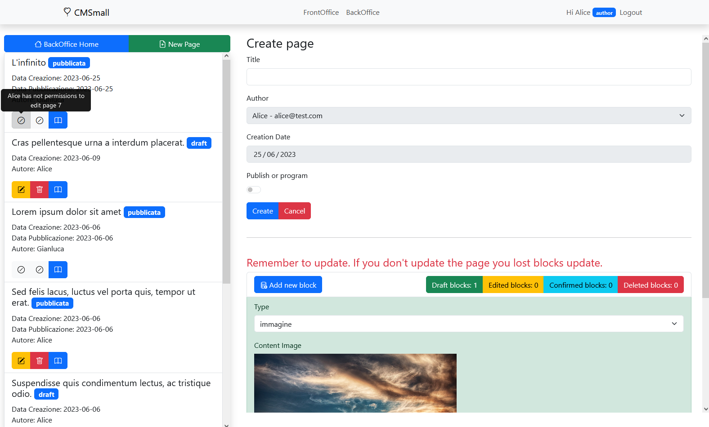

# CMSmall

- [React Client Application Routes](#react-client-application-routes)
  * [Front-office](#front-office)
  * [Back-office](#back-office)
- [API Server](#api-server)
  * [Autenticazione](#autenticazione)
  * [Amministrazione](#amministrazione)
  * [Gestione pagine e blocchi](#gestione-pagine-e-blocchi)
  * [Gestione risorse statiche](#gestione-risorse-statiche)
- [Database Tables](#database-tables)
- [Main React Components](#main-react-components)
- [Screenshot](#screenshot)
- [Users Credentials](#users-credentials)

## React Client Application Routes
### Front-office
- Route `/`: Home page del front-office. E' visualizzata la lista di tutte le pagine pubblicate e visibili al pubblico ordinate per data di pubblicazione decrescente. 
- Route `/page/:slug`: Visualizzazione di una pagina pubblicata avente un dato slug.
- Route `/login`: Form di autenticazione
- Route `*`: Pagina 404 not found.

### Back-office
- Route `/back-office`: Home page del back-office. Per tutte le pagine del back-office viene visualizzata una sidebar che permette di mostrare la lista di tutte le pagine con la possibilità di editarle visualizzarle e cancellarle (nel caso in cui si disponga dei permessi necessari).
- Route `/back-office/edit/:pageId`: Form di variazione di una pagina fornito il suo pageId. E' possibile inoltre aggiungere nuovi blocchi, modificare il contenuto ed il tipo dei blocchi, rimuovere blocchi e modificare la posizione nella pagina dei blocchi.
- Route `/back-office/add`: Form di creazione di una pagina. Permette di creare una nuova pagina indicando un titolo ed opzionalmente una data di pubblicazione. E' possibile inoltre aggiungere nuovi blocchi, modificare il contenuto ed il tipo dei blocchi, rimuovere blocchi e modificare la posizione nella pagina dei blocchi.
- Route `/back-office/preview/:pageId`: Preview di una pagina dato il suo id. Nel back-office qualsiasi pagina può essere visualizzata da qualsiasi autore.
- Route `/back-office/settings`: Form di variazione dei settaggi disponibile solamente per gli admin.

## API Server

### Autenticazione
- POST `/api/sessions` Forniti username e password genera una nuova sessione. Restituisce i dettagli della sessione creata errore in caso di credenziali non valide.
  - request body content
  <pre>
    {
        "username": "admin@test.com",
        "password" : "pwd"
    }
  </pre>
  - response body content
   <pre>
    {
      "id": 1,
      "username": "admin@test.com",
      "name": "Gianluca",
      "role": "admin"
    }
  </pre>

- GET `/api/sessions/current` Restituisce i dettagli della sessione corrente errore in caso di sessione non valida.
  - request parameters : None
  - response body content
  <pre>
    {
      "id": 1,
      "username": "admin@test.com",
      "name": "Gianluca",
      "role": "admin"
    }
  </pre>
- DELETE `/api/sessions/current` Cancella la sessione corrente. Restituisce errore in caso di sessione corrente non valida.

### Amministrazione

- GET `/api/users` Restituisce la lista degli utenti presenti nella piattaforma. Errore in caso di permessi insufficienti. 
  - middlewares: `isAdmin` 
  - request parameters : None
  - response body content:
    <pre>
      [
        {
          "id": 1,
          "username": "admin@test.com",
          "name": "Gianluca",
          "role": "admin"
        },
        ...
      ]
    </pre>

- GET `/api/settings/:k` Restituisce il valore di un settaggio di chiave k ed i dettagli di contatto dell'utente autore dell'ultima modifica su tale settaggio. Errore in caso di permessi insufficienti.
  - middlewares: `isAdmin` 
  - request parameters : `k` is the key of setting <i>ex. title</i>
  - response body content: (author is linked to the last update)
    <pre>
      {
        "author": {
          "name": "Gianluca",
          "email": "admin@test.com"
        },
        "title": "CMSmall 2"
      }
    </pre>
- PUT `/api/settings/:k` Setta il valore di un settaggio di chiave k. Errore in caso di permessi insufficienti.
  - request parameters : `k` is the key of setting <i>ex. title</i>
  - request body: 
    <pre>
      {
        "title": "Titolo"
      }
    </pre>
  - response body content: number of changes

### Gestione pagine e blocchi

- GET `/api/pages` Restituisce la lista di tutte le pagine registrate  a sistema. Errore in caso di permessi insufficienti.
  - middlewares: `isLoggedIn` 
  - request parameters : None
  - response body content:
    <pre>
      [
          {
            "id": 1,
            "title": "Lorem ipsum dolor sit amet",
            "slug": "pagina-1",
            "creationDate": "2023-06-06",
            "publishDate": "2023-06-06",
            "status": "pubblicata",
            "author": "Alice"
          }, 
          ...
      ]
    </pre>
- GET `/api/pages/:id` Restituisce una pagina fornito il suo id. Nel dto della pagina viene fornita anche la lista dei blocchi associati alla pagina. Errore in caso di permessi insufficienti.
  - middlewares: `isLoggedIn` 
  - request parameters : pageId
  - response body content:
    <pre>
    {
      "id": 12,
      "title": "Ciao mondo ",
      "slug": "ciao-mondo",
      "creationDate": "2023-06-22",
      "publishDate": "2023-06-22",
      "status": "pubblicata",
      "author": "Carol",
      "blocks": [
        {
          "id": 52,
          "type": "paragrafo",
          "pageId": 12,
          "position": 1,
          "content": "paragrafo p"
        },
        ...
      ]
    }
    </pre>
- GET `/api/pages/filters?filterId=published` Fornisce la lista di tutte le pagine pubblicate.
  - request parameters : `filterId`
  - response body content:
    <pre>
    {
      "id": 12,
      "title": "Ciao mondo ",
      "slug": "ciao-mondo",
      "creationDate": "2023-06-22",
      "publishDate": "2023-06-22",
      "status": "pubblicata",
      "author": "Carol"
    }
    </pre>
- GET `/api/pages/filters?filterId=slug&value=v` Restituisce una pagina con i suoi blocchi se pubblica dato il suo slug. Errore in caso la pagina non sia presente nel sistema.
  - request parameters : `filterId` `value` 
  - response body content:
    <pre>
    {
      "id": 12,
      "title": "Ciao mondo ",
      "slug": "ciao-mondo",
      "creationDate": "2023-06-22",
      "publishDate": "2023-06-22",
      "status": "pubblicata",
      "author": "Carol",
      "blocks": [
        {
          "id": 52,
          "type": "paragrafo",
          "pageId": 12,
          "position": 1,
          "content": "paragrafo p"
        },
        ...
      ]
    }
    </pre>
- POST `/api/pages/:id` Permette di salvare a sistema una nuova pagina fornendo le informazioni di una pagina ed i blocchi ad essa collegati. Restituisce errore in caso di permessi insufficienti o mancata verifica della business rule: ogni pagina deve contenere almeno un blocco header ed almeno un blocco immagine o paragrafo.
  - middlewares: `isLoggedIn`, `blocksValidation`
  - request parameters : None
  - request body content:
    <pre>
      {
          "title": "Le 20 spiagge più belle Italia",
          "creationDate": "2023-06-06",
          "publishDate": "2023-06-06",
          "blocks" : [
              {
                  "type": "header",
                  "content": "Lorem ipsum dolor sit amet - header"
              },
              {
                  "type": "paragrafo",
                  "content": "Lorem ipsum dolor sit amet - header"
              }
          ]
      }
    </pre>
  - response body content:
    <pre>
      {
        "pageId": 7,
        "blockIds": [
          3,
          4
        ]
      }
    </pre>
- DELETE `/api/pages/:pageId` Cancella una pagina dato il suo id. Restituisce errore in caso di permessi non validi. 
  - middlewares: `isLoggedIn`, `userCanOperate` 
  - request parameters : `pageId`
  - response body content: number of rows affected.

- PUT `/api/pages/:id` Permette di editare una pagina dato il suo id e la nuova versione modificata della pagina. Restituisce errore in caso di permessi insufficienti o pagina inesistente. Se utente amministratore permette anche la variazione dell'utente autore. Il campo blocks è opzionale, se presente deve contenere la nuova versione della lista dei blocchi di una data pagina sulla quale verrà eseguita la verifica della business rule: ogni pagina deve contenere almeno un blocco header ed almeno un blocco immagine o paragrafo. 
  - middlewares: `isLoggedIn`, `checkIdMatch`, `pageExistsAndUserCanOperate`, `blocksValidation`
  - request parameters : `id`
  - request body content: <i>The field blocks is optional</i>
    <pre>
      {
          "id": 15,
          "title": "Le 20 spiagge più belle della Sardegna",
          "creationDate": "2023-06-06",
          "publishDate": "2023-06-06",
          "authorId": 2,
          "blocks" : [
              {
                  "type": "header",
                  "content": "Lorem ipsum dolor sit amet - header"
              },
              {
                  "type": "paragrafo",
                  "content": "Lorem ipsum dolor sit amet - header"
              }
          ]
      }
    </pre>
  - response body content: number of rows affected.
    <pre>
      {
        "pageUpdated":1,
        "blocksUpdated":2
      }
    </pre>

### Gestione risorse statiche
- GET `/api/static` Restituisce la lista dei file statici serviti dal server. Errore in caso di permessi insufficienti.
  - middlewares: `isLoggedIn` 
  - request parameters : None
  - response body content:
    <pre>
      {
        "images": [
          {
            "name": "beach-g10e271efa_1280.jpg",
            "uri": "/static/images/beach-g10e271efa_1280.jpg"
          },
          ...
        ]
      }
    </pre>

## Database Tables

- Table `users` - (id, email, name, role, salt, password)
- Table `pages` - (id, title, slug, authorId, creation_date, publish_date)
- Table `blocks` - (id, type, pageId, position, content)
- Table `settings` - (k, v)

## Main React Components

- `MyNavbar` (in `Miscellaneous.jsx`): Navbar dinamica. Se l'utente è autenticato visualizza nome e role dell'utente e permette all'utente di eseguire il logout richiamando la funzione doLogOut(). 
- `MyAlert` (in `Miscellaneous.jsx`): Alert configurabile che mostra una lista di messaggi (settati in App.jsx come). In caso di nessun messaggio l'alert scompare. 
- `PageRoutes` (in `Miscellaneous.jsx`): Sidebar visualizzata nel back-office. Permette all'untente di conoscere la lista aggiornata delle pagine presenti a sistema in ordine cronologico decrescente rispetto la data di creazione. Se in possesso di permessi permette all'utente di cancellare una pagina ed accedere al form per poterla editare. 
- `HomePage` (in `PageLayout.jsx`): Home page del front-office permette di visualizzare la lista delle pagine pubblicate in ordine cronologico decrescente rispetto la data di pubblicazione.
- `LoginForm` Form che permette di eseguire l'autenticazione di un utente richiamando la funzione doLogIn().
- `Page` (in `Page.jsx`) Componente utilizzato sia nel back-office che nel fornt-office per poter viasualizzare una pagina. Il componente viene configurato per essere utilizzato in entrambi i casi: nel back-office la pagina viene ottenuta dal server tramite id mentre nel front-office la pagina viene restituita dato uno slug.
- `PageForm` Componente che permette la modifica e la gestione dei blocchi di una pagina. E' composto da due sotto componenti BlockForm, per la gestione del singolo bloco, UpdateCreateForm, utilizzato per la modifica e creazione di una nuova pagina. 
- `SettingsForm` (in `SettingsForm.jsx`) Form che permette la variazione dei settagi del sito web. In questo contesto è limitato alla gestione del titolo.

## Screenshot
<i>Lo screenshot mostra nella sidebar la lista delle pagine presenti nel sistema, nel body il form di creazione di una nuova pagina.</i>

## Users Credentials

- admin@test.com, pwd (admin)
- author@test.com, pwd (author)
- alice@test.com, pwd (author - utente che ha creato almeno due pagine)
- harry@test.com, pwd (author - utente che non ha creato alcuna pagina)
- carol@test.com, pwd (admin)
